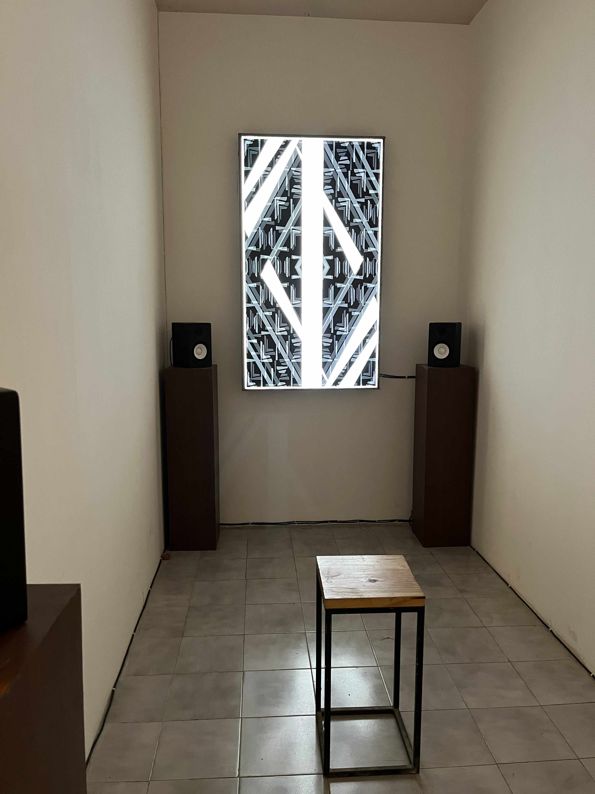
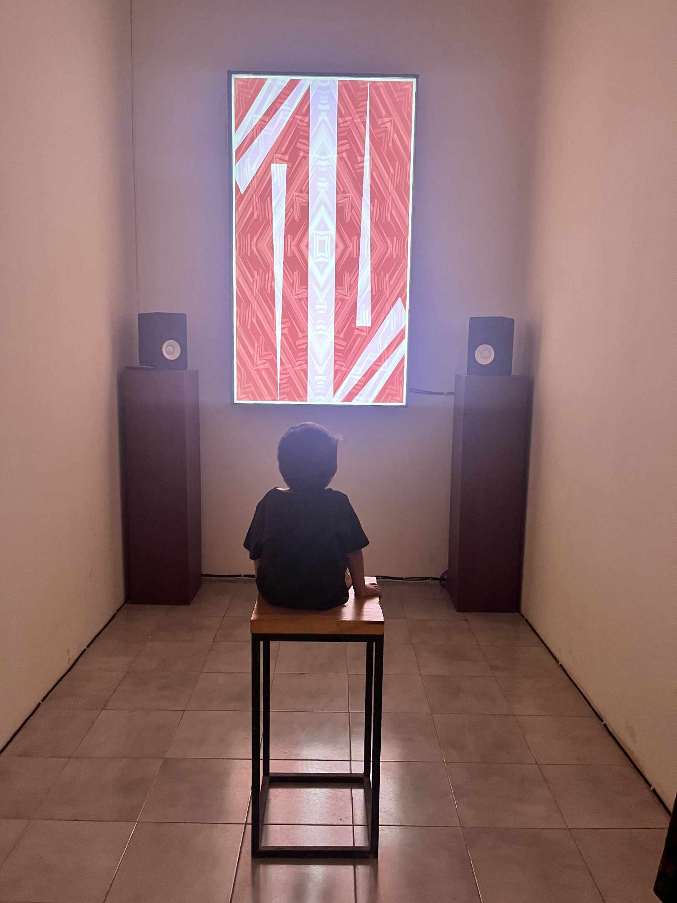
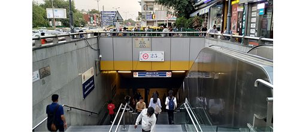
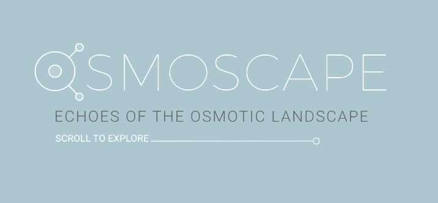
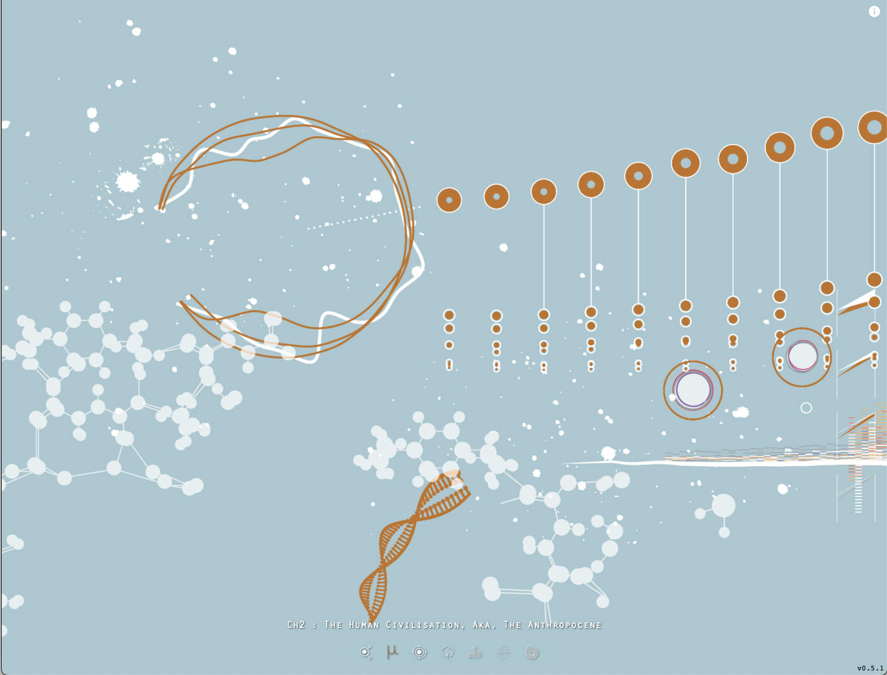
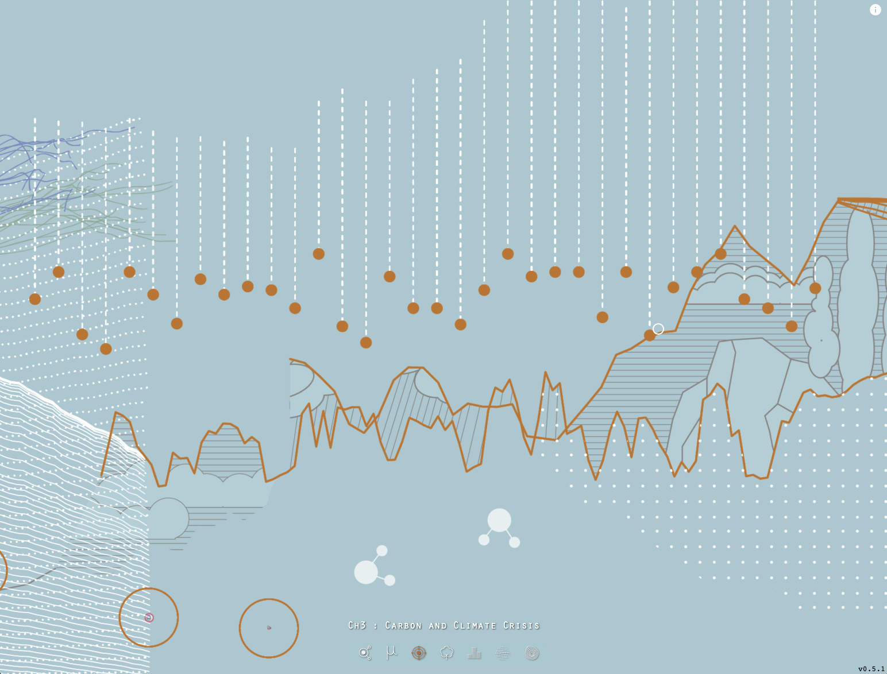
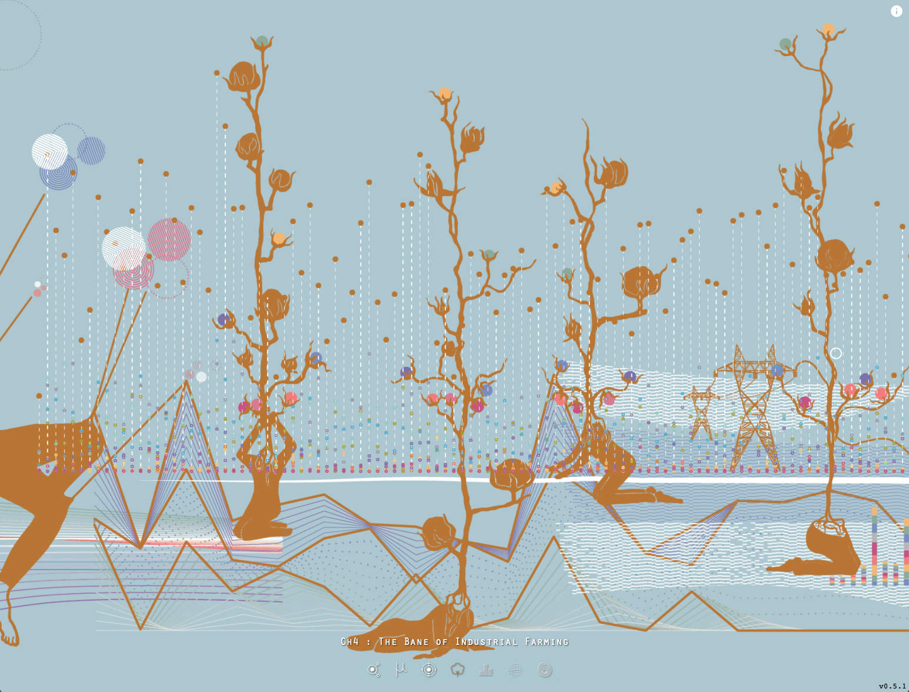
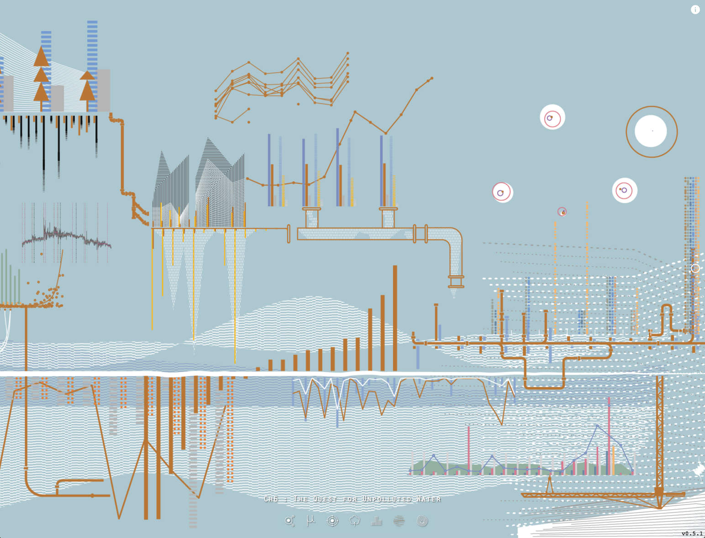

## Collab-Scape, 2020 and 2022

Patterns emerge from monotones of traditional world tunings as they curve into the creation of new sounds activated by viewer participation. Partakers unconsciously activate their region’s tuning system by allowing their internet connection to pick up analytics of their location data. As visitors immerse themselves in communicating with other dots on the screen, they become unknowing collaborators of new tones and tunes. The tones produced, almost untraceable to their source while they begin to pull themselves out from a growing dictionary of scales and tuning systems. When more people begin to ride these sound waves, a rhythm develops. This rhythm slowly brainwashes the mind into a hypnotic massage of wanting to stay when you have to leave.

* First presented at [Future Landing](http://futurelanding.serendipityartsvirtual.com/), a virtual art exhibition hosted by [Serendipity Arts Foundation](http://serendipityarts.org/)
* Curated by [Veerangana Solanki](https://www.serendipityartsfestival.com/curator/veerangana-solanki)
* Sound design and composition by Abhinay Khoparzi
* Visuals on [Olivia Jack](https://ojack.xyz)'s [Hydra Synth](https://hydra.ojack.xyz) by Abhinay Khoparzi
* Based on an Initial sketch and websockets engine by [Ashish Dubey](https://instagram.com/dash1291)
* Tuning systems based on the amazing work by [Andrew Bernstein & Ben Taylor](https://github.com/abbernie/tune/), porting Victor Cerullo's exhaustive [Scala tuning archive](https://www.huygens-fokker.org/scala/)
* Sequencing on the webaudio API with Yotam Mann's [Tone.js](http://tonejs.github.io/)

### Technical Details

The piece came about based on an initial sketch by Ashish involving a very simple web interface that featured a couple of dots on a 2D canvas - each representing a live visitor. A user on the web page can move its dot across the 2D plane which reflects on every user’s webpage. Each change in position is accompanied with movement across the stereo sound field, changing the perception of sound for each visitor in 2D space. We used a library called socket.io to allow for dealing with the network bits of communicating the joining and leaving of a visitor and sharing changes in position.

The next step was using custom tunings, more elaborate compositions, and a major visual revamp. We utilised tune.j, a library that supports 1000s of tunings to choose from and use in a WebAudio application. To aid and speed my composition I took the base sequencing engine of Tone.js and added a better translation layer that works with a variant of Alex McLean's TidalCycles called miniTidal into sequences for sounds in Tone.js. I also added a drone based generative composition that would slowly fade in after spending some time in the piece and soon take over most of the lower end of the sound spectrum for a sonically rich experience. For visuals I included a clockwork like generative visual built on Hydra and p5 to transform Collab-Scape into a visual and musically developed experience that would put visitors in a meditative trance. I also added a few modulations to the sound design of the instruments used in each composition that would evolve as the users moved their "avatars" all over the screen. We also wanted the peice to not feel like a lonely place, so we added some "bots" that would often enter the room to shake up the composition and after sometime quietly leave.

Ashish has written more about his work with Collab-Scape and our collaboration with Samarth Gulati in producing Future Landing on [his blog](http://ashishdubey.xyz/interactive-soundscape-on-web.html) and also [open sourced the code](https://github.com/dash1291/collabscape) for others to enjoy and develop further.

## Metro Sonata, 2019

Metro Sonata is an interactive sound installation, based on the soundscape of the Delhi Metro by Ameet Singh. It was first presented to public as part of Goethe-Institut's Five Million Incidents engagements in October - December of 2019.

[Facebook](https://www.facebook.com/events/2559647130741279/2559647137407945/)

[Instagram](https://www.instagram.com/metrosonata/)

A surge of humanity descends into the cavernous tunnels of the Metro, deep beneath New Delhi, their ears surrounded by the sonic atmosphere of clangs, drones, hydraulic whines of the coaches blending with the systematized announcements. The humdrum white noise of humans and machines. A casual stride or a passing wave of the hand suddenly makes that what is not listened to into music. The music heard is not linear, like the song of the whirring and clanging of machines, but is instead something that we co-create, as humans have always made. The ennui and drudgery of the journey recedes into the background and travel momentarily becomes a joyous affair. This is the music of a public place – of a rapid mass transit system.

* Concept and audio recordings by [Ameet Singh](https://www.goethe.de/ins/in/en/kul/art/fmi/ams.html)
* Audio Engine Programming & Sound Design - Abhinay Khoparzi
* Interaction Design - [Praveen Sinha](https://instagram.com/imp8lite)







## Osmoscape, 2017

[“OsmoScape”](https://app.osmoscape.com) explores a graphical notation score, where data and graphs related to water have been arranged to form a sound score and a book.  The found data was then converted into an image using processing code that becomes the visual bases of a score, leading eventually to sound compositions being constructed out of user engagement via a WebApp, exploring a new way of archiving 55 datasets with their stories and sounds.

* Concept, Project Management and System Design by [Nandita Kumar](https://nanditakumar.com)
* CREATIVE DEVELOPERS [TimeBlur Studios](https://timeblur.io) and Himanshu Erande
* DATA VISUALIZATION IN [PROCESSING](http://processing.org/) Abhinay Khoparzi
* SOUND DESIGN Jacob Bergson
* SOUND INTERACTION FOR WEBAPP [Sound.Codes](https://sound.codes)
* GRAPHIC DESIGN/BOOK DESIGN Trusha Sawant
* UI DESIGN Studio Mesmer and Trusha Sawant
* CO-WRITER FOR BOOK Supriya Vohra (independent journalist)

## Shader Art

[Julia Fractals of 2020](shader-art/julia.md), a month's worth of sketches exploring various experiments with Julia fractals through the month of July 2020

[Marching signed distance fields](shader-art/marching.md), a month's worth of Marching.js sketches exploring various experiments with Signed Distance Fields and combinatorial geometries through the month of March 2021.

