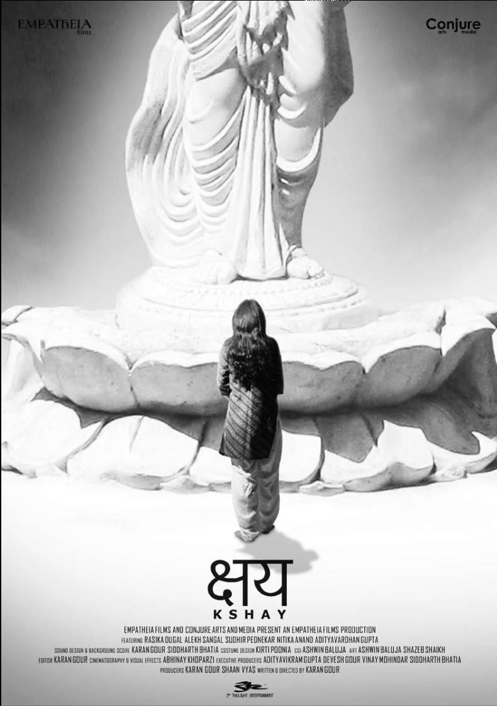
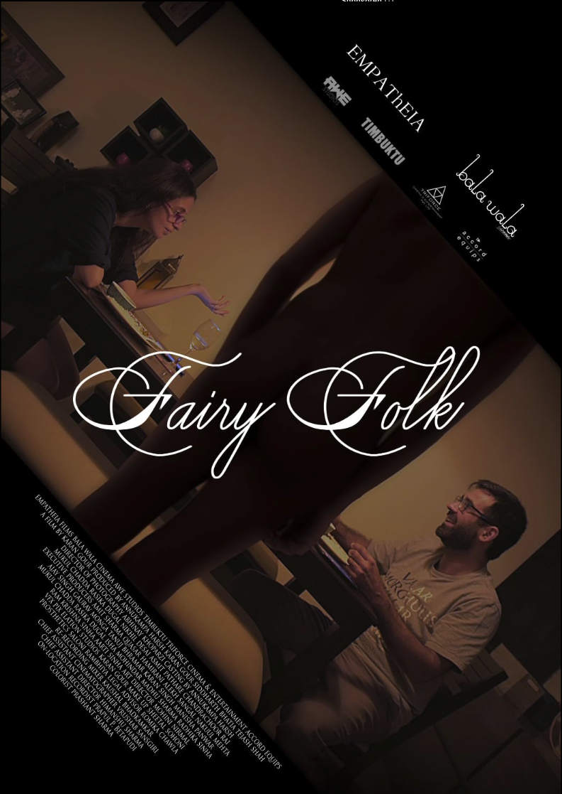

## Kshay or Corrode, 2012

[IMDB](https://www.imdb.com/title/tt1669648/)

Introducing the talented face of [Rasika Dugal](https://en.wikipedia.org/wiki/Rasika_Dugal) in her first lead role opposite Alekh Sangal, it took two men (writer/director [Karan Gour](karan-gour.md) and cinematographer, technical director and VFX Lead Abhinay Khoparzi) four years and $10,000 to complete Corrode. Everything was done in a 2-room apartment that doubled up as a prop workshop, a green screen studio, an ADR studio (Karan’s bedroom became the recording booth, while Abhinay’s bedroom was the control room) and an editing studio.

Corrode went on to be a breakthrough, critically-acclaimed indie, which won awards at many film festivals including winning the ‘Asian New Talent Award’ at the Shanghai International Film Festival (the prize money was twice the budget of the film). Karan won the ‘Best Director’ award at SAIFF, New York and the ‘Best Film’ award at IFFLA, Los Angeles.  After its year long run at film festivals, Corrode released theatrically in India followed by a Netflix and Amazon release.
 
For Karan and Abhinay, Corrode was more than just a stepping stone into films. It taught them things about filmmaking that no film school could ever teach. How to grapple with frustration, how to get a film’s aesthetic to inform the narrative while maintaining alignment with the film’s budget – the delicate ratio of compromise. Needless to say, a feature film done in such circumstances takes an enormous amount of focus and dedication. 

## Fairy Folk, 2022

[IMDB](https://www.imdb.com/title/tt20202992/)

[Instagram](https://www.instagram.com/fairyfolkthefilm/)

Featuring a cast with the likes of Mukul Chadda and Rasika Dugal, Abhinay’s second feature film collaboration with Karan, Fairy Folk, is currently looking for distribution platforms. This time too, the duo handled deparments all over the production, albeit with more resources than they ever had on Corrode. Produced by Empatheia Films, the duo's production imprint and Bala Wala Films led by actor/producer Annukampa Harsh, the film has also been supported by Awe Films and Accord Equips. Fairy folk made its debut in the festival circuit at Sydney International Film festival, playing the first screening at Event Cinemas in downtown Sydney and New Town Cinemas in the art district. The film went on to engage audiences at Indian Film Festival of Melbourne, and Chicago International Film Festival where it was nominated for a Q-Hugo Award for Best LGBTQ Film, and is now going to play at the MAMI Film Festival (Mumbai Academy of Moving Image), on the [1st of Nov, 2023](https://mami.mumbaifilmfestival.com/detail/?UID=69EC6EA6-702E-4637-AD89-1EA0750EB2A4).







